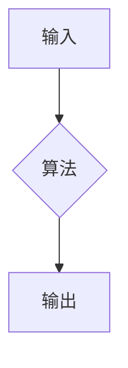
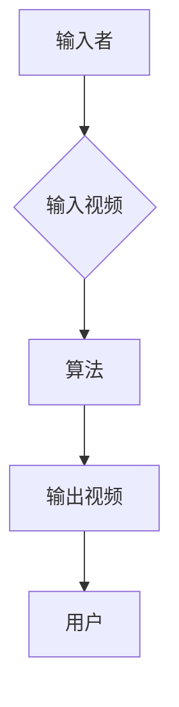

写在前面：以下的所有想法欢迎任何思考和讨论

Preface: All the following thoughts are open to any reflections and discussions
--------------------------------------------------------------------------------------------------------------------------------------------------------------------------------------
第一部分：该项目背后的哲学原理

PART Ⅰ THE PRINCIPLES OF PHILOSOPHY
--------------------------------------------------------------------------------------------------------------------------------------------------------------------------------------
将世界区分为自我与他者，他者愈发清晰，愈发触手可及，对确立自我的要求也就越急迫，进而促成自我的完整和清晰。本算法旨在尽力拟合以整体人类的理性与感性对某一视频做出的反应（为方便叙述，此处的视频作为特定例子代替所有媒介），从而为用户提供一个“大他者”，以最大化用户的福祉。

By dividing the world into self and other, the other becomes increasingly distinct and tangible, thereby heightening the urgency to establish the self and ultimately fostering its integrity and clarity. This algorithm endeavours to approximate the collective rational and emotional response of humanity to a given video (here employed as a representative example of all media for narrative convenience), thereby presenting users with a 'grand other' to maximise their well-being.
--------------------------------------------------------------------------------------------------------------------------------------------------------------------------------------
第二部分：该算法工作的具体流程（以视频平台为例，初步构想）

PART Ⅱ The specific workflow of the algorithm (using a video platform as an example, preliminary concept)
--------------------------------------------------------------------------------------------------------------------------------------------------------------------------------------
算法在系统内部工作，因此，我们需要视频的输入端和输出端。

文字表述：输入→算法→输出

流程图：

输入部分由输入者输入视频构成，输出端由输出视频被用户接受构成。

文字表述：输入者→输入视频→算法→输出视频→用户

流程图：

在算法过程中，我们将视频解构分为技术类部分（AI完成）与非技术部分（人类完成）。同时，视频将分为文字，音频，图画部分，这三部分都将作为原始素材进入两个评估体系。
